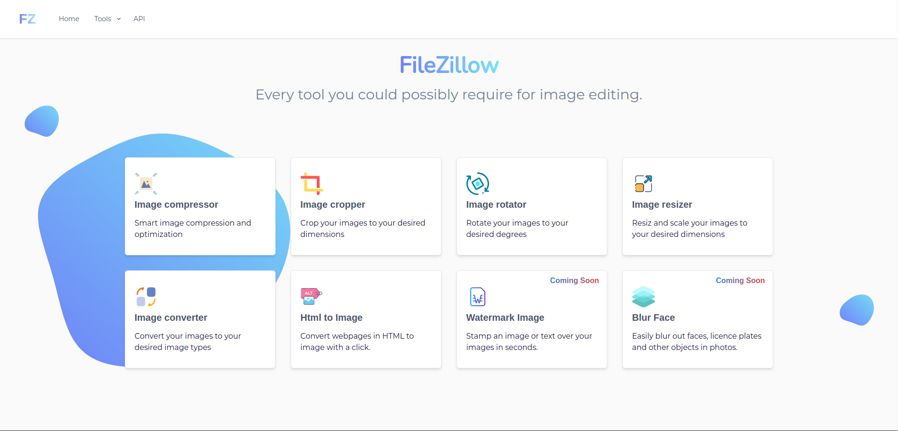
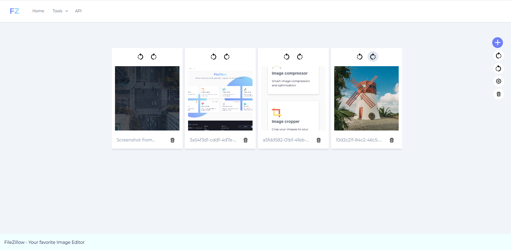
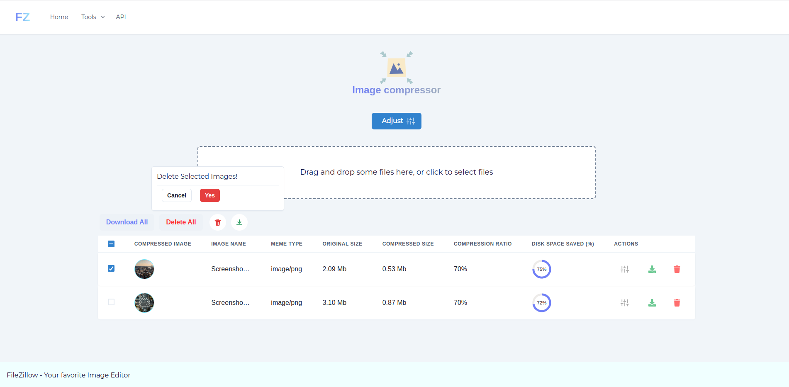
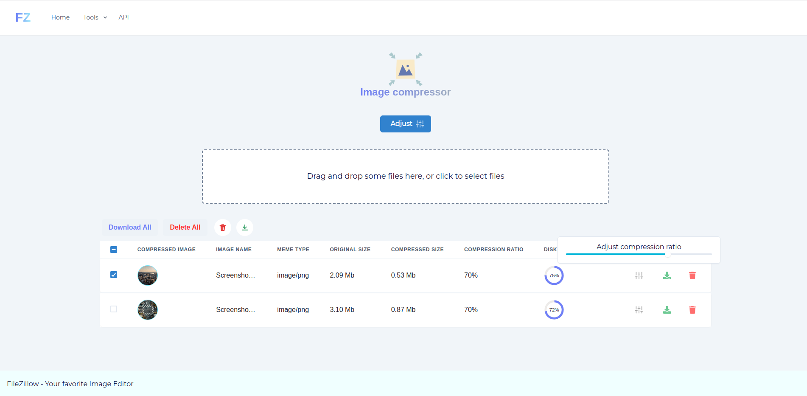
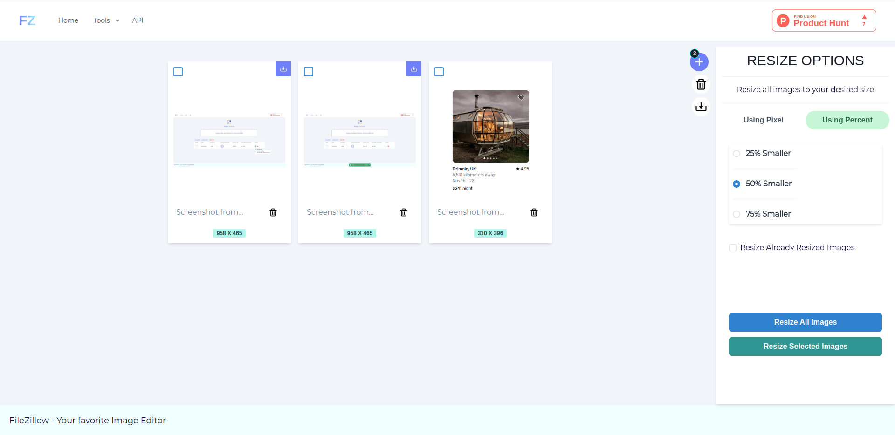

# Image Compressor - Visual Studio Code Extension

Image Compressor is a powerful Visual Studio Code extension that provides a suite of image manipulation tools right within your favorite code editor. With this extension, you can efficiently perform tasks such as image compression, conversion, cropping, resizing, and much more, without leaving the comfort of Visual Studio Code.

## Features

- **Image Compression**: Reduce the file size of your images without compromising quality, making them more suitable for web usage or reducing storage space.
- **Image Conversion**: Convert images between various formats, including JPEG, PNG, GIF, BMP, and TIFF.
- **Image Cropping**: Effortlessly crop images to remove unwanted portions or focus on specific areas of interest.
- **Image Resizing**: Change the dimensions of your images while maintaining the aspect ratio or defining custom width and height values.
- **Image Rotation**: Rotate images clockwise or counterclockwise by any arbitrary angle to adjust their orientation.
- **Image Flipping**: Flip images horizontally or vertically to achieve desired mirroring effects.
- **Image Watermarking**: Add custom watermarks or copyright information to your images to protect your intellectual property.
- **Image Metadata**: View and modify metadata attributes of images, such as EXIF data, including camera information, date, and more.
- **Batch Processing**: Perform operations on multiple images simultaneously, saving you valuable time and effort.

## Preview

## Requirements

This extension requires Visual Studio Code version 1.66.0 or higher.

## Installation

1. Launch Visual Studio Code.
2. Open the Extensions view by clicking on the square icon on the left sidebar or pressing `Ctrl+Shift+X`.
3. Search for "Image Compressor" in the search box.
4. Locate the extension in the search results and click the "Install" button.
5. After installation, the extension will be activated automatically.

## Usage

1. Open the Command Palette by pressing `Ctrl+Shift+P` (Windows/Linux) or `Cmd+Shift+P` (Mac).
2. Type "Image Compressor" in the command input and select a specific operation from the available options.
3. Follow the prompts or options provided by the extension to complete the desired image manipulation task.

## Configuration

- compression level for image compression.
- image format for image conversion.
- dimensions for image resizing.
- watermark text and position for image watermarking.

## Known Issues

- The extension may encounter issues with certain image formats or unsupported image metadata.

If you discover any issues or have suggestions for improvement, please [open an issue](https://github.com/Humed-Muhammad/image-compressor/issues) in the extension's GitHub repository.

## License

This extension is released under the MIT License. See the LICENSE file for more details.

## Acknowledgments

Image Compressor was inspired by the need for efficient image manipulation tools within Visual Studio Code. We would like to thank the open-source community for their invaluable contributions and the developers of the underlying libraries that power this extension.

## Contact

For support, feedback, or inquiries, you can reach us at support@example.com.

---

Thank you for choosing Image Compressor! We hope this extension enhances your image manipulation workflow in Visual Studio Code.

